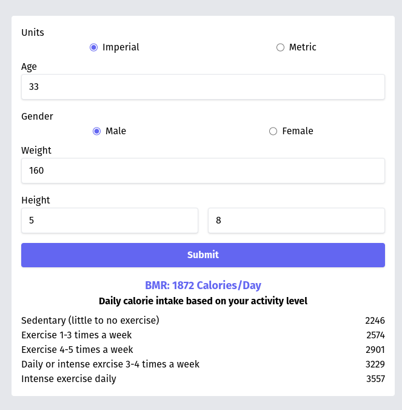

# Daily Calorie Calculator

A simple clojurescript reagent app to calculate BMR and daily calorie intake using reagent and tailwindcss. Shown in tutorial video [here.](https://youtu.be/oKdE1oMs6Gk)

## Technologies

This application is built with the following technologies.

- [reagent](https://reagent-project.github.io/) - clojurescript react wrapper
- [tailwindcss](https://tailwindcss.com/) - utility css framework

## Installation

This project uses the [Clojure CLI](https://clojure.org/guides/deps_and_cli) as the package manager. [Shadow CLJS](https://shadow-cljs.github.io/docs/UsersGuide.html) and [npm](https://nodejs.org/en) is used as the build tools for the frontend, the clojurescript dependencies are still contained in the deps.edn file.

## Usage

To start the application in development mode you can run the command `npm dev` and you can access the frontend app on port 3000. This script will run both shadow-cljs watch and transpile the tailwind css source file.
